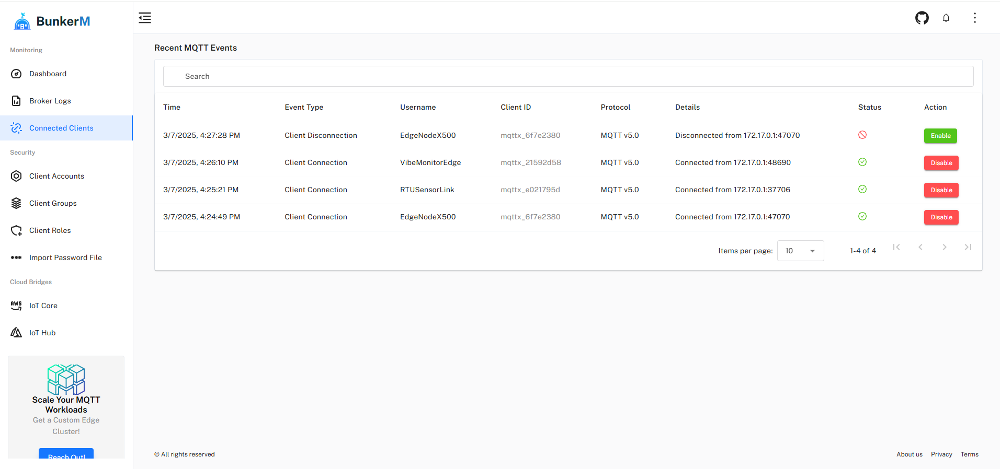

# BunkerM - MQTT Made Easy ✅  
<p align="center">
  <a href="https://bunkeriot.github.io/BunkerM/">
    
  </a>
</p>
<p align="center">
  <a href="https://www.reddit.com/r/BunkerM/">
    
  </a>
  <a href="https://www.linkedin.com/in/mehdi-idrissi/">
    
  </a>
  <a href="https://x.com/BunkerIoT">
    
  </a>
</p>


[](https://www.paypal.com/donate/?hosted_button_id=ZFEJHMWKU2Q4Q)

## 📋 Table of Contents

- [ What is BunkerM?](#what-is-bunkerm)
- [💼 Need Custom MQTT Features? Reach Out Today!](#need-custom-mqtt-features-reach-out-today)
- [Solution Overview](#solution-overview)
- [ Quick Start with Docker](#quick-start-with-docker)
- [⭐ Core Features](#core-features)
  - [Broker Dashboard](#broker-dashboard)
  - [Access Control List (ACL) Management](#access-control-list-acl-management)
  - [Cloud Integration (Pro Feature)](#cloud-integration-pro-feature)
  - [REST API (Coming soon)](#rest-api-coming-soon)
  - [MQTT Client Management](#mqtt-client-management)
- [🛠️ Troubleshooting](#troubleshooting)
- [✨ Features](#features)
  - [Infrastructure & Scaling](#infrastructure--scaling)
  - [Core Management](#core-management)
  - [Security](#security)
  - [Cloud & Database Integrations](#cloud--database-integrations)
  - [Monitoring & User Management](#monitoring--user-management)
  - [Protocol Support](#protocol-support)
  - [MQTT Features](#mqtt-features)
  - [Platform Support](#platform-support)
- [💰 Community vs Paid versions](#community-vs-paid-versions)
- [❤️ Support BunkerM Project](#support-bunkerm-project)
- [📜 License](#license)

<a id="what-is-bunkerm"></a>
## 🔍 What is BunkerM?

BunkerM is an open-source, containerized MQTT management solution that bundles together a Mosquitto broker with a comprehensive web interface. It provides a complete, ready-to-deploy MQTT environment with built-in management capabilities, eliminating the need for separate broker setup and configuration.


This all-in-one solution features dynamic security controls, real-time monitoring, client activity logging, and cloud integration capabilities. The entire stack - Mosquitto broker, backend services, and frontend UI - comes pre-configured in Docker containers for easy deployment and management.

<a id="need-custom-mqtt-features-reach-out-today"></a>
## 💼 Need Custom MQTT Features? Reach Out Today!

> **Website**: https://bunkeriot.com  
> **Email me at**: support@bunkeriot.com  
> **Let's connect**!  
[](https://www.linkedin.com/in/mehdi-idrissi/)  

<a id="solution-overview"></a>
## 🏗️ Solution Overview


* Mosquitto MQTT Broker (pre-configured)
* Backend Management Services
* Web-based Management Interface
* Dynamic Security Module
* Monitoring and Logging System
* Cloud Bridge Integration (Pro Feature)

<a id="quick-start-with-docker"></a>
## 🚀 Quick Start with Docker  

Get up and running in seconds with **BunkerM**!  

### 1. Run the Docker Container  

Make sure to have [Docker](https://www.docker.com/get-started) installed on your machine before running the command below:

```bash
docker run -d -p 1900:1900 -p 2000:2000 bunkeriot/bunkerm
```

This command:
- Runs BunkerM in detached mode (`-d`)
- Maps the MQTT broker port to 1900 (`-p 1900:1900`)
- Maps the Web UI port to 2000 (`-p 2000:2000`)
- Uses the official BunkerM image (`bunkeriot/bunkerm`)

### Persistent Data Deployment

For production environments, you'll want to persist your data across container restarts:

```bash
docker run -d -p 1900:1900 -p 2000:2000 \
  -v mosquitto_data:/var/lib/mosquitto \
  -v mosquitto_conf:/etc/mosquitto \
  -v auth_data:/data \
  bunkeriot/bunkerm
```

This command adds:
- A volume for Mosquitto data (`-v mosquitto_data:/var/lib/mosquitto`)
- A volume for authentication data (`-v auth_data:/data`)

### Remote Access Installation

If you need to access BunkerM from outside the host machine:

```bash
docker run -d -p 1900:1900 -p 2000:2000 \
  -e HOST_ADDRESS=<HOST_IP> \
  bunkeriot/bunkerm
```

Replace `<HOST_IP>` with your host machine's IP address or domain name.

### 2. Access the Interface

- Open your browser and navigate to `http://localhost:2000`
- The BunkerM web interface will load directly without any security warnings

### 3. Connect to the MQTT Broker

- **Default port:** `1900`
- **Make sure to add a new MQTT client** from the UI (**Client Accounts** menu) to connect to the broker.


<a id="core-features"></a>
## ⭐ Core Features

### Broker Dashboard

Monitor and control MQTT client connections in real-time through the "Recent MQTT Events" dashboard:

- Connected clients count
- Message statistics
- Byte transfer rates
- Subscription tracking
- Retained message counts


### 🔒 Access Control List (ACL) Management

Manage your MQTT broker's clients:


#### Client Management
- Create new MQTT clients
- Set client credentials
- Manage client permissions
- Group assignments

#### Role Management
- Create and configure roles
- Set up ACL rules
- Define topic permissions
- Manage access patterns

#### Group Management
- Create client groups
- Assign roles to groups
- Manage group members
- Set priorities

### ☁️ Cloud Integration (Pro Feature)

Connect to major cloud providers:

#### AWS IoT Core Bridge
- AWS IoT endpoint configuration
- Certificate management
- Topic mapping
- Secure communication

#### Azure IoT Hub Bridge
- IoT Hub connection setup
- Device authentication
- SAS token management
- Topic routing  

### 🔌 REST API (Coming soon)

### 👥 MQTT Client Management

  

This module provides a real-time list of currently connected clients on a node, along with the ability to connect or disconnect an MQTT client using the "Enable" and "Disable" buttons.

<a id="troubleshooting"></a>
## 🛠️ Troubleshooting

- Verify Docker is running
- Check port availability (2000)
- Monitor Docker logs
- Verify network connectivity
- Check SSL certificate configuration

<a id="features"></a>
## ✨ Features

### Infrastructure & Scaling
| Feature | Community | Pro | Enterprise |
|---------|:---------:|:---:|:----------:|
| Max Clients | Unlimited | Unlimited | Unlimited |
| High Availability & Clustering | ✗ | ✗ | ✓ |
| Clustering for High Availability | ✗ | ✗ | ✓ |
| Cluster Management UI | ✗ | ✗ | ✓ |
| Load Balancer | ✗ | ✗ | ✓ |
| Cluster Management REST API | ✗ | ✓ | ✓ |
| Enhanced HA Monitoring | ✗ | ✗ | ✓ |

### Core Management
| Feature | Community | Pro | Enterprise |
|---------|:---------:|:---:|:----------:|
| Dynamic Security | ✓ | ✓ | ✓ |
| BunkerM Cluster Cloud Management | ✗ | ✗ | ✓ |
| Multiple Connected Brokers | ✓ | ✓ | ✓ |
| Edge Management UI | ✓ | ✓ | ✓ |

### Security
| Feature | Community | Pro | Enterprise |
|---------|:---------:|:---:|:----------:|
| Client Authentication (ID+Password) | ✓ | ✓ | ✓ |
| Offline Authentication | ✗ | ✓ | ✓ |
| Client Certificate Authentication | ✗ | ✗ | ✓ |
| Self-Signed SSL | ✓ | ✓ | ✓ |
| PSK Authentication | ✗ | ✗ | On-demand |
| Dynamic Security Plugin | ✓ | ✓ | ✓ |
| ACLs (Client, Role, Group Levels) | ✓ | ✓ | ✓ |
| Anonymous Client Access | ✗ | ✓ | ✓ |
| Custom CAs | ✗ | ✗ | On-demand |
| HTTPS/TLS Termination | ✗ | ✗ | ✓ |
| Audit Trail | ✗ | ✗ | On-demand |
| OAuth 2.0 / JWT Authentication | ✓ | ✓ | ✓ |
| LDAP Authentication | ✗ | ✗ | ✓ |

### Cloud & Database Integrations
| Feature | Community | Pro | Enterprise |
|---------|:---------:|:---:|:----------:|
| Azure IoT Hub | ✗ | ✓ | ✓ |
| AWS IoT Core | ✗ | ✓ | ✓ |
| Kafka Bridge | ✗ | ✗ | On-demand |
| MongoDB/Atlas Bridge | ✗ | ✗ | On-demand |
| MySQL Bridge | ✗ | ✗ | On-demand |
| PostgreSQL Bridge | ✗ | ✗ | On-demand |
| MariaDB Bridge | ✗ | ✗ | On-demand |
| TimescaleDB Bridge | ✗ | ✗ | On-demand |
| Amazon Redshift Bridge | ✗ | ✗ | On-demand |
| CockroachDB Bridge | ✗ | ✗ | On-demand |
| MS SQL Server Bridge | ✗ | ✗ | On-demand |
| Oracle DB Bridge | ✗ | ✗ | On-demand |
| Snowflake Bridge | ✗ | ✗ | On-demand |
| InfluxDB Metrics Exporter | ✗ | ✗ | On-demand |
| Prometheus Metrics Exporter | ✗ | ✗ | On-demand |

### Monitoring & User Management
| Feature | Community | Pro | Enterprise |
|---------|:---------:|:---:|:----------:|
| Broker Insights | ✓ | ✓ | ✓ |
| Connected Clients Listing | ✓ | ✓ | ✓ |
| Broker Status | ✗ | ✓ | ✓ |
| User Authentication | ✓ | ✓ | ✓ |
| Unlimited Users | ✗ | ✗ | ✓ |
| User Roles & RBAC | ✗ | ✗ | ✓ |
| Single Sign-On (SSO) | ✗ | ✗ | ✓ |
| REST APIs | ✗ | ✗ | ✓ |
| Application Tokens | ✓ | ✓ | ✓ |
| Client Control | ✓ | ✓ | ✓ |

### Protocol Support
| Feature | Community | Pro | Enterprise |
|---------|:---------:|:---:|:----------:|
| MQTT V3.1.1 | ✓ | ✓ | ✓ |
| MQTT V5 | ✓ | ✓ | ✓ |
| MQTT over TLS (MQTTS) | ✓ | ✓ | ✓ |
| WebSockets (WS) | ✓ | ✓ | ✓ |
| WebSockets over TLS (WSS) | ✓ | ✓ | ✓ |
| Sparkplug | ✗ | ✗ | ✓ |
| Sparkplug Decoding | ✓ | ✓ | ✓ |

### MQTT Features
| Feature | Community | Pro | Enterprise |
|---------|:---------:|:---:|:----------:|
| Quality of Service (QoS) Levels | ✓ | ✓ | ✓ |
| Last Will Messages | ✓ | ✓ | ✓ |
| Retained Messages | ✓ | ✓ | ✓ |
| Persistent Connections | ✓ | ✓ | ✓ |
| Mount Points | ✓ | ✓ | ✓ |

### Platform Support
| Feature | Community | Pro | Enterprise |
|---------|:---------:|:---:|:----------:|
| Docker (Linux, Windows, macOS, RPi) | ✓ | ✓ | ✓ |
| RPM (RedHat, CentOS, Rocky Linux) | ✓ | ✓ | ✓ |
| Kubernetes | ✓ | ✓ | ✓ |
| OpenShift | ✓ | ✓ | ✓ |
| Windows | ✓ | ✓ | ✓ |
| White Labeling | ✗ | ✗ | ✓ |

<a id="community-vs-paid-versions"></a>
## 💰 Community vs Paid versions

My mission with BunkerM is to democratize IoT by making MQTT management accessible to everyone. The Community Version is designed to be lightweight, easy to use, and completely free, offering essential features for individuals and small projects.

However, to sustain the development of the Community Version and continue delivering value, I'm introducing Pro and Enterprise Versions. These versions are tailored for businesses and advanced users, offering additional features like:

- Local authentication (no internet required)  
- Fine-grained RBAC (Role-Based Access Control)
- LDAP and SSO integrations
- Advanced monitoring and analytics
- Enterprise-grade support

The revenue from the Pro and Enterprise versions will directly support the development and maintenance of the free Community Version. This way, I can keep BunkerM accessible to everyone while also meeting the needs of larger organizations.

If the open-source community shows enough support, I may consider making the Pro version free as well. Your feedback and contributions are invaluable in shaping the future of BunkerM!

<a id="support-bunkerm-project"></a>
## ❤️ Support BunkerM Project

BunkerM is an open-source project dedicated to making MQTT broker management accessible and secure for everyone. As a solo developer, I've poured countless hours into creating a comprehensive solution that combines the power of Mosquitto with an intuitive management interface, all while keeping it free for non-commercial use.

Your donation helps support:
* Continuous development of new features
* Maintenance and bug fixes
* Documentation improvements
* Community support

Every contribution, no matter the size, helps keep this project active and growing. If you find BunkerM useful in your projects or learning journey, consider supporting its development. Together, we can make IoT and MQTT technology more accessible to developers worldwide.

[](https://www.paypal.com/donate/?hosted_button_id=ZFEJHMWKU2Q4Q)

Thank you for supporting open source! 🙏

<a id="license"></a>
## 📜 License

This project is licensed under the Apache License 2.0.
You are free to use, modify, and distribute this software, even for commercial purposes, under the terms of the license.

📜 Full license details: LICENSE  
💼 For any inquiries, feel free to reach out: support@bunkeriot.com
