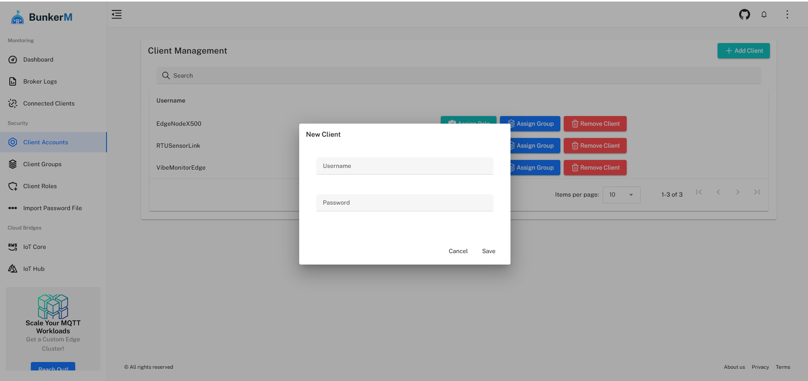

# Quick Start Guide

This guide will help you get up and running with BunkerM quickly. We'll cover the basics of starting the container, accessing the web interface, and creating your first MQTT client.

## Starting BunkerM

The fastest way to start BunkerM is using Docker:

```bash
docker run -d -p 1900:1900 -p 2000:2000 bunkeriot/bunkerm
```

This command will:
- Download the BunkerM image (if not already present)
- Start a container in detached mode
- Map port 1900 for MQTT communication
- Map port 2000 for the web interface

## Accessing the Web Interface

1. Open your web browser and navigate to `https://localhost:2000`
2. You'll see a security warning about the SSL certificate (this is normal as BunkerM uses a self-signed certificate)
3. Click "Advanced" and then "Proceed to localhost (unsafe)"
4. You should see the BunkerM login page


## First Login

For your first login, use the following credentials:

- **Username**: admin
- **Password**: admin

!!! warning
    For security reasons, you should change the default password immediately after your first login.

## Creating Your First MQTT Client

Before you can connect to the MQTT broker, you need to create a client:

1. In the left sidebar, navigate to **MQTT Management** > **Client Management**
2. Click the **Add client** button in the top right corner
3. Enter a username and password for your MQTT client
4. Click **Save**



## Connecting to the MQTT Broker

Now that you've created a client, you can connect to the MQTT broker using any MQTT client application:

- **Broker Address**: localhost (or your server's IP address)
- **Port**: 1900
- **Username**: The client username you created
- **Password**: The client password you created

### Example with Mosquitto CLI

```bash
mosquitto_pub -h localhost -p 1900 -u your_client_username -P your_client_password -t test/topic -m "Hello from BunkerM!"
```

### Example with MQTT Explorer

1. Download and install [MQTT Explorer](http://mqtt-explorer.com/)
2. Create a new connection with the following settings:
   - **Host**: localhost
   - **Port**: 1900
   - **Username**: Your client username
   - **Password**: Your client password
3. Click **Connect**

## Monitoring MQTT Activity

BunkerM provides real-time monitoring of MQTT activity:

1. Navigate to the **Dashboard** in the left sidebar
2. View the "Recent MQTT Events" panel to see real-time connection and message activity
3. Check the "Broker Statistics" panel for overall performance metrics

## Next Steps

Now that you have BunkerM up and running, you can:

- [Configure broker settings](../mqtt/broker-configuration.md)
- [Set up role-based access control](../mqtt/role-management.md)
- [Organize clients into groups](../mqtt/group-management.md)
- [Monitor broker and client logs](../monitoring/broker-logs.md)

For more detailed information, explore the rest of the documentation. 