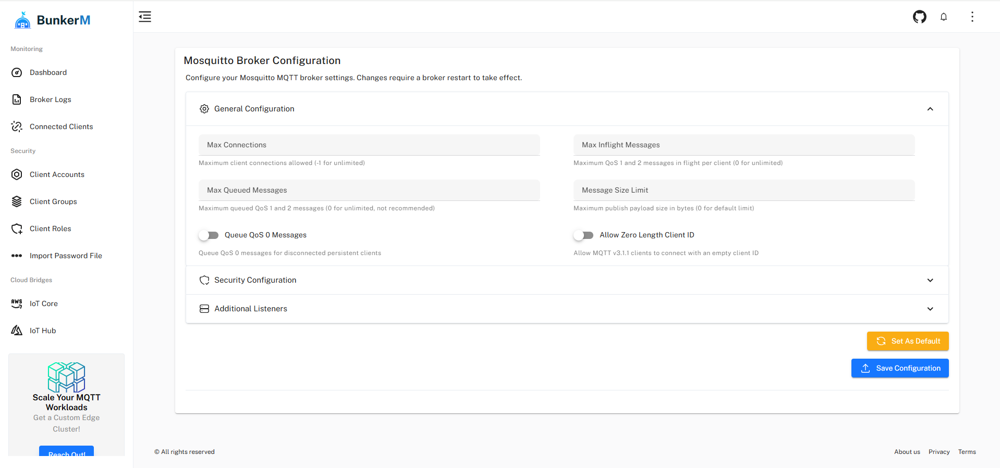

# Broker Configuration

The Broker Configuration interface in BunkerM provides a user-friendly way to configure the Mosquitto MQTT broker without having to edit configuration files manually. This powerful feature allows you to customize various aspects of your broker's behavior to suit your specific requirements.

## Configuration Overview

The broker configuration page is organized into expandable sections, each containing related settings:

- **General Configuration**: Basic broker settings
- **Security**: Authentication and access control settings
- **Performance**: Settings that affect broker performance
- **Persistence**: Message storage and retention settings
- **Logging**: Log level and format settings
- **Advanced**: Additional specialized settings

## General Configuration

This section contains fundamental broker settings:

### Connection Settings

- **Max Connections**: Maximum number of client connections allowed (-1 for unlimited)
- **Max Inflight Messages**: Maximum number of QoS 1 and 2 messages in flight per client
- **Max Queued Messages**: Maximum number of QoS 1 and 2 messages that can be queued for a client
- **Allow Anonymous**: Whether to allow clients to connect without credentials (not recommended for production)

### Protocol Settings

- **Protocol Version**: MQTT protocol versions to support (3.1, 3.1.1, 5.0)
- **Allow Zero Length Client ID**: Whether to allow clients to connect with an empty client ID

## Security Configuration

This section contains settings related to security:

### TLS/SSL Settings

- **Use TLS/SSL**: Enable or disable TLS/SSL encryption
- **Certificate Path**: Path to the server certificate file
- **Key Path**: Path to the server private key file
- **CA Certificate**: Path to the Certificate Authority certificate file
- **Require Certificate**: Whether to require clients to provide a certificate
- **Use PSK**: Whether to use pre-shared keys for authentication

### Authentication

- **Password File Path**: Path to the password file (when not using dynamic security)
- **Allow Anonymous**: Whether to allow unauthenticated connections
- **Use Dynamic Security**: Whether to use the dynamic security plugin (enabled by default in BunkerM)

## Performance Configuration

This section contains settings that affect broker performance:

### Resource Limits

- **Max Connections**: Maximum number of concurrent client connections
- **Max QoS 0 Messages In-flight**: Maximum number of QoS 0 messages being processed simultaneously
- **Max QoS 1/2 Messages In-flight**: Maximum number of QoS 1/2 messages being processed simultaneously
- **Memory Limit**: Maximum memory usage for the broker (in MB)

### Message Size Limits

- **Max Packet Size**: Maximum size of MQTT packets in bytes
- **Max Payload Size**: Maximum size of message payloads in bytes

## Persistence Configuration

This section contains settings related to message storage:

### Persistence Settings

- **Persistence Enabled**: Whether to store messages and subscriptions to disk
- **Persistence Location**: Directory where persistence files are stored
- **Autosave Interval**: How often to save persistence data (in seconds)

### Retained Messages

- **Retain Available**: Whether to allow retained messages
- **Retained Message Expiry**: Whether retained messages should expire
- **Retained Message Expiry Interval**: How long retained messages should be kept (in seconds)

## Logging Configuration

This section contains settings related to logging:

### Log Settings

- **Log Type**: Where to send logs (stdout, stderr, file)
- **Log Destination**: Path to the log file (if log type is file)
- **Log Level**: Detail level of logs (none, error, warning, notice, information, debug)
- **Log Timestamp**: Whether to include timestamps in log messages
- **Log Timestamp Format**: Format of timestamps in logs

## Advanced Configuration

This section contains additional specialized settings:

### Bridge Settings

- **Bridge Support**: Whether to enable MQTT bridge functionality
- **Bridge Protocol Version**: MQTT protocol version to use for bridges

### WebSockets

- **WebSockets Enabled**: Whether to enable WebSocket support
- **WebSockets Port**: Port to use for WebSocket connections
- **WebSockets TLS Port**: Port to use for secure WebSocket connections

## Applying Configuration Changes

After making changes to the broker configuration:

1. Review your changes carefully
2. Click the **Save Configuration** button at the bottom of the page
3. Confirm that you want to apply the changes
4. The broker will be restarted to apply the new configuration

!!! warning
    Restarting the broker will temporarily disconnect all clients. Plan configuration changes during maintenance windows for production environments.

## Configuration Backup

It's recommended to back up your broker configuration before making significant changes:

1. Navigate to **MQTT Management** > **Import/export ACL**
2. Click **Export ACL** to download your current configuration
3. Store this backup in a safe location

## Best Practices

### Security

- Disable anonymous access in production environments
- Use TLS/SSL encryption for all connections
- Regularly rotate certificates and keys
- Set appropriate access controls using roles and ACLs

### Performance

- Set reasonable limits for message size and queue depth
- Monitor broker performance and adjust settings as needed
- Consider your hardware capabilities when configuring limits

### Persistence

- Enable persistence for production environments
- Ensure sufficient disk space for persistence files
- Set an appropriate autosave interval (balance between data safety and performance)

## Related Documentation

- [Client Management](client-management.md) - Managing MQTT client accounts
- [Role Management](role-management.md) - Configuring access control
- [Broker Logs](../monitoring/broker-logs.md) - Monitoring broker activity
- [Troubleshooting](../troubleshooting.md) - Solving common issues 