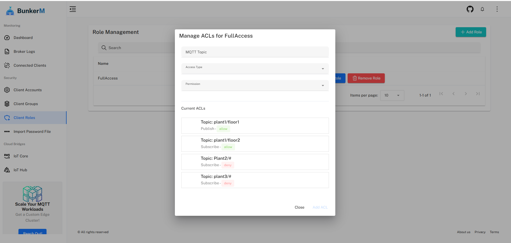

# Role Management

The Role Management interface in BunkerM allows you to define access control rules that determine what MQTT topics clients can publish to and subscribe to. Roles are a key component of BunkerM's security model, enabling fine-grained access control for your MQTT environment.

## Understanding Roles

A role in BunkerM is a collection of access control rules (ACLs) that define:

- Which topics a client can publish to
- Which topics a client can subscribe to
- Whether access is allowed or denied for each topic pattern

Roles can be assigned directly to clients or to groups of clients, making it easy to manage permissions at scale.

## Role Overview

The role management page displays a table of all configured roles with the following information:

- **Name**: The role's unique identifier
- **Description**: A brief description of the role's purpose
- **Clients**: The number of clients directly assigned this role
- **Groups**: The number of groups assigned this role
- **Actions**: Buttons for managing the role

## Adding a New Role

To create a new role:

1. Click the **Add role** button in the top right corner
2. In the dialog that appears, enter:
   - **Name**: A unique identifier for the role
   - **Description**: (Optional) A description of the role's purpose
3. Click **Save**
4. You'll be redirected to the ACL management interface for the new role

## Managing Role Permissions

After creating a role, you'll need to define its permissions:

### Viewing Role Details

To view a role's current permissions:

1. Click the **View permissions** button for the role
2. A dialog will display all ACL rules associated with the role

### Managing ACL Rules

To modify a role's permissions:

1. Click the **Manage role** button for the role
2. In the ACL management interface, you can:
   - **Add new rules**: Click "Add Rule" to create a new permission
   - **Edit existing rules**: Modify the topic patterns and permissions
   - **Remove rules**: Delete rules that are no longer needed

For each ACL rule, you'll define:

- **Topic Pattern**: The MQTT topic pattern this rule applies to (supports wildcards)
- **Permission Type**: Whether this is a publish or subscribe permission
- **Access**: Whether to allow or deny access to the specified topic

### Topic Pattern Syntax

BunkerM supports standard MQTT wildcard syntax in topic patterns:

- **Single-level wildcard** (`+`): Matches exactly one topic level
  - Example: `sensor/+/temperature` matches `sensor/kitchen/temperature` but not `sensor/kitchen/upstairs/temperature`

- **Multi-level wildcard** (`#`): Matches any number of topic levels
  - Example: `sensor/#` matches `sensor/temperature`, `sensor/kitchen/temperature`, etc.

### Permission Precedence

When multiple rules could apply to a topic, BunkerM follows these precedence rules:

1. More specific rules take precedence over more general rules
2. Deny rules take precedence over allow rules
3. If no rule matches, access is denied by default

## Removing a Role

To delete a role:

1. Click the **Remove role** button for the role
2. Confirm the deletion in the confirmation dialog

!!! warning
    Deleting a role will remove all associated permissions. Clients that were using this role will lose these permissions unless they have other roles assigned.

## Role Assignment

Roles can be assigned in two ways:

1. **Direct assignment to clients**: Through the [Client Management](client-management.md) interface
2. **Assignment to groups**: Through the [Group Management](group-management.md) interface

## Best Practices

### Security

- Follow the principle of least privilege: give clients only the permissions they need
- Use specific topic patterns rather than overly broad wildcards
- Regularly audit role permissions to ensure they remain appropriate

### Organization

- Create roles based on functional requirements rather than individual clients
- Use descriptive names and detailed descriptions for roles
- Document the purpose and scope of each role

### Common Role Patterns

- **Read-only role**: Allow subscribe to specific topics, deny all publish
- **Write-only role**: Allow publish to specific topics, deny all subscribe
- **Admin role**: Allow publish and subscribe to all topics
- **Device-specific role**: Allow access only to topics related to a specific device

## Related Documentation

- [Client Management](client-management.md) - Assigning roles to clients
- [Group Management](group-management.md) - Assigning roles to groups
- [ACL Configuration](acl-configuration.md) - Detailed access control configuration
- [Dynamic Security](../advanced/dynamic-security.md) - Advanced security features 