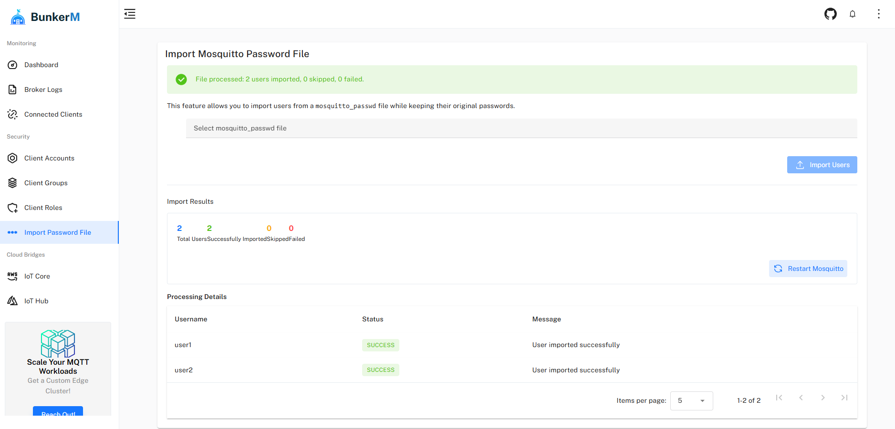

# Password Management

BunkerM provides advanced password management features to help you migrate from existing Mosquitto installations and manage client credentials efficiently.



## Importing from Mosquitto Password File

If you're migrating from a standard Mosquitto broker, BunkerM allows you to import users from a `mosquitto_passwd` file while preserving their original password hashes.

### What is a Mosquitto Password File?

A Mosquitto password file is created and managed using the `mosquitto_passwd` utility that comes with Mosquitto. It contains usernames and hashed passwords for MQTT clients.

Example of a `mosquitto_passwd` file content (not human-readable):
```
user1:$6$QrAVXYZ$kbGxQa5jgDfIYE/...
user2:$6$AbCdEfG$hJkLmNoP/qRsTuV...
```

### Import Process

To import users from a Mosquitto password file:

1. Navigate to **MQTT Management** > **Import Mosquitto Password File**
2. Click the file input field and select your `mosquitto_passwd` file
3. Click **Import Users**
4. The system will process the file and display import results

### Import Results

After the import process completes, BunkerM will display a summary of the results:

- **Total Users**: The total number of users found in the file
- **Successfully Imported**: Users that were successfully added to BunkerM
- **Skipped**: Users that already exist in BunkerM (based on username)
- **Failed**: Users that could not be imported due to errors

For each user, you'll see detailed information about the import status and any issues encountered.

### Considerations

When importing users from a Mosquitto password file:

- Usernames must be unique; if a username already exists in BunkerM, the import for that user will be skipped
- The password hashes are preserved, allowing users to continue using their existing passwords
- Imported users will not have any roles or group memberships assigned by default
- After import, you'll need to assign appropriate roles and groups to the imported users

## Password Security

BunkerM implements strong password security practices:

### Password Hashing

All passwords in BunkerM are securely hashed using modern cryptographic algorithms. The system never stores passwords in plain text.

### Password Requirements

When creating or updating passwords, BunkerM enforces the following requirements:

- Minimum length: 8 characters
- Should contain a mix of uppercase and lowercase letters, numbers, and special characters

### Password Rotation

For enhanced security, consider implementing a password rotation policy:

1. Regularly update client passwords
2. Use unique passwords for each client
3. Keep a record of password changes

## Resetting Admin Password

If you've forgotten the admin password for the BunkerM web interface:

1. Access the Docker container:
   ```bash
   docker exec -it <container_id> /bin/bash
   ```

2. Navigate to the application directory:
   ```bash
   cd /app
   ```

3. Run the password reset script:
   ```bash
   node reset-admin-password.js
   ```

4. The admin password will be reset to the default: `admin`

5. Log in with the default password and immediately change it to a secure password

## Best Practices

### Security

- Use strong, unique passwords for each client
- Regularly rotate passwords, especially for critical clients
- Limit access to password files and backups
- Use TLS/SSL encryption to protect password transmission

### Migration

- Back up your existing configuration before importing
- Test the import process in a non-production environment first
- Verify client connectivity after migration
- Document the migration process and results

### Management

- Establish a clear password policy
- Document password reset procedures
- Consider using a password manager for administrative credentials
- Audit password changes regularly

## Related Documentation

- [Client Management](../mqtt/client-management.md) - Managing MQTT client accounts
- [Dynamic Security](dynamic-security.md) - Advanced security features
- [Broker Configuration](../mqtt/broker-configuration.md) - Configuring authentication settings
- [Troubleshooting](../troubleshooting.md) - Solving authentication issues 