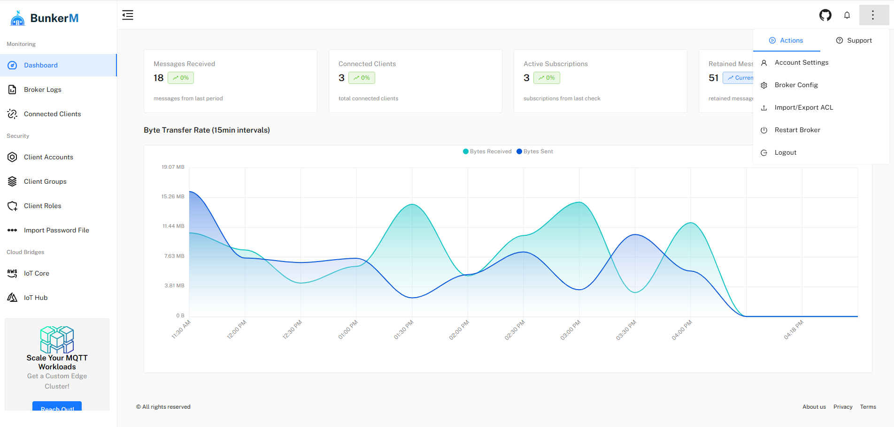

# BunkerM - Introduction

Welcome to the official documentation for BunkerM, the all-in-one Mosquitto MQTT broker with a comprehensive web UI for easy management.



## What is BunkerM?

BunkerM is an open-source, containerized MQTT management solution that bundles together a Mosquitto broker with a comprehensive web interface. It provides a complete, ready-to-deploy MQTT environment with built-in management capabilities, eliminating the need for separate broker setup and configuration.

This all-in-one solution features:

- **ACL management** - Manage client authentication and Role Based Access control
- **Real-time monitoring** - Track broker performance and client connections
- **Client activity logging** - Monitor MQTT client activity and troubleshoot issues
- **Client Administration** - Enable / Disable MQTT client in real time
- **Cloud integration capabilities** - Connect to AWS IoT Core and Azure IoT Hub (Pro feature)

The entire stack - Mosquitto broker, backend services, and frontend UI - comes pre-configured in Docker containers for easy deployment and management.

## Key Features

### 1. Broker Dashboard
Monitor and control MQTT client connections in real-time:
- Connected clients count
- Message statistics
- Byte transfer rates
- Subscription tracking
- Retained message counts

### 2. Access Control List (ACL) Management
Manage your MQTT broker's clients:

- **Client Management**
  - Create new MQTT clients
  - Set client credentials
  - Manage client permissions
  - Group assignments

- **Role Management**
  - Create and configure roles
  - Set up ACL rules
  - Define topic permissions
  - Manage access patterns

- **Group Management**
  - Create client groups
  - Assign roles to groups
  - Manage group members
  - Set priorities

### 3. Cloud Integration (Pro Feature)
Connect to major cloud providers:

- **AWS IoT Core Bridge**
  - AWS IoT endpoint configuration
  - Certificate management
  - Topic mapping
  - Secure communication

- **Azure IoT Hub Bridge**
  - IoT Hub connection setup
  - Device authentication
  - SAS token management
  - Topic routing

## Quick Start

Get up and running in seconds with BunkerM:

```bash
# With non-persistent data
docker run -d -p 1900:1900 -p 2000:2000 bunkeriot/bunkerm

# With persistent data
docker run -d -p 1900:1900 -p 2000:2000 -v mosquitto_data:/var/lib/mosquitto -v auth_data:/data bunkeriot/bunkerm

# For remote connection (from outside the host machine)
docker run -p 2000:2000 -p 1900:1900 -e HOST_ADDRESS=<HOST_IP> bunkeriot/bunkerm
```

## Getting Started

- [Installation](getting-started/installation.md) - Detailed installation instructions
- [Quick Start](getting-started/quick-start.md) - Get up and running quickly
- [First Login](getting-started/first-login.md) - Initial setup and configuration

## Support BunkerM

BunkerM is an open-source project. If you find it useful, please consider supporting its development:

- [GitHub Repository](https://github.com/bunkeriot/bunkerm)
- [Website](https://www.bunkeriot.com)
- [Contact](mailto:m.idrissi@bunkeriot.com)

## License

BunkerM is licensed under the Apache License 2.0. 