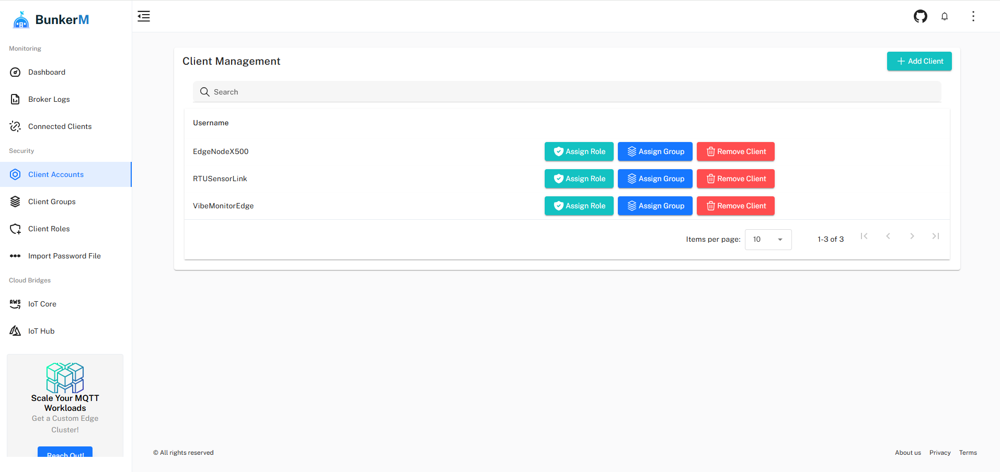

# Client Management

The Client Management interface in BunkerM allows you to create, manage, and control MQTT client accounts. This is where you define which clients can connect to your broker and manage their authentication credentials.



## Client Overview

The client management page displays a table of all configured MQTT clients with the following information:

- **Username**: The client's username used for authentication
- **Groups**: Any groups the client belongs to
- **Roles**: Roles assigned to the client (directly or via groups)
- **Status**: Whether the client is currently enabled or disabled
- **Actions**: Buttons for managing the client

## Adding a New Client

To add a new MQTT client:

1. Click the **Add client** button in the top right corner
2. In the dialog that appears, enter:
   - **Username**: A unique identifier for the client
   - **Password**: The client's authentication password
3. Click **Save**

!!! note
    Client usernames must be unique and can only contain alphanumeric characters, hyphens, and underscores.

## Managing Existing Clients

For each client in the list, you can perform several management actions:

### Assigning Roles

To assign a role directly to a client:

1. Click the **Assign role** button for the client
2. In the dialog that appears, select one or more roles from the available roles list
3. Click **Save**

Roles define what topics the client can publish to and subscribe to. See [Role Management](role-management.md) for more details.

### Assigning Groups

To add a client to one or more groups:

1. Click the **Assign group** button for the client
2. In the dialog that appears, select one or more groups from the available groups list
3. Click **Save**

Groups allow you to organize clients and assign roles to multiple clients at once. See [Group Management](group-management.md) for more details.

### Removing a Client

To delete a client:

1. Click the **Remove client** button for the client
2. Confirm the deletion in the confirmation dialog

!!! warning
    Deleting a client is permanent and cannot be undone. The client will immediately lose access to the broker.

## Client Authentication

BunkerM uses username and password authentication for MQTT clients. When a client attempts to connect to the broker, it must provide the credentials you've configured here.

Example connection with the Mosquitto client:

```bash
mosquitto_pub -h localhost -p 1900 -u client_username -P client_password -t test/topic -m "Hello"
```

## Client Access Control

Client access to topics is controlled through the role-based access control system:

1. **Direct Role Assignment**: Roles assigned directly to a client
2. **Group Role Inheritance**: Roles inherited from groups the client belongs to

The effective permissions for a client are the combination of all permissions from all assigned roles.

## Import and Export

BunkerM provides functionality to import and export client configurations using the Mosquitto Dynamic Security JSON format.

### Importing Clients

To import clients from a JSON file:

1. Navigate to **MQTT Management** > **Import/export ACL**
2. In the "Import ACL" section, click the file input field
3. Select a valid dynamic security JSON file
4. Click **Import ACL**

The import process will add all clients, roles, and groups defined in the JSON file to your BunkerM instance.

### Exporting Clients

To export your current client configuration:

1. Navigate to **MQTT Management** > **Import/export ACL**
2. In the "Export ACL" section, click **Export ACL**
3. The system will generate a JSON file containing all clients, roles, and groups
4. Save the file to your local system

The exported file follows the Mosquitto Dynamic Security JSON structure and can be used for backup or to transfer configurations between BunkerM instances.

!!! note
    For more information about the Mosquitto Dynamic Security JSON format, refer to the [official Mosquitto documentation](https://github.com/eclipse-mosquitto/mosquitto/blob/master/test/broker/dynamic-security-init.json).

## Importing from Mosquitto Password File

If you're migrating from a standard Mosquitto broker, BunkerM allows you to import users from a `mosquitto_passwd` file:

1. Navigate to **MQTT Management** > **Import Mosquitto Password File**
2. Click the file input field and select your `mosquitto_passwd` file
3. Click **Import Users**
4. The system will process the file and display import results

This feature preserves the original password hashes, allowing users to continue using their existing credentials.

## Best Practices

### Security

- Use strong, unique passwords for each client
- Regularly rotate client credentials
- Delete unused clients promptly

### Organization

- Use a consistent naming convention for clients
- Group clients by function or department
- Assign roles based on the principle of least privilege

### Monitoring

- Regularly review the client list for unauthorized or unused clients
- Check client connection logs to identify unusual patterns
- Monitor failed authentication attempts

## Related Documentation

- [Role Management](role-management.md) - Managing access control roles
- [Group Management](group-management.md) - Organizing clients into groups
- [ACL Configuration](acl-configuration.md) - Detailed access control configuration
- [Client Logs](../monitoring/client-logs.md) - Monitoring client activity 